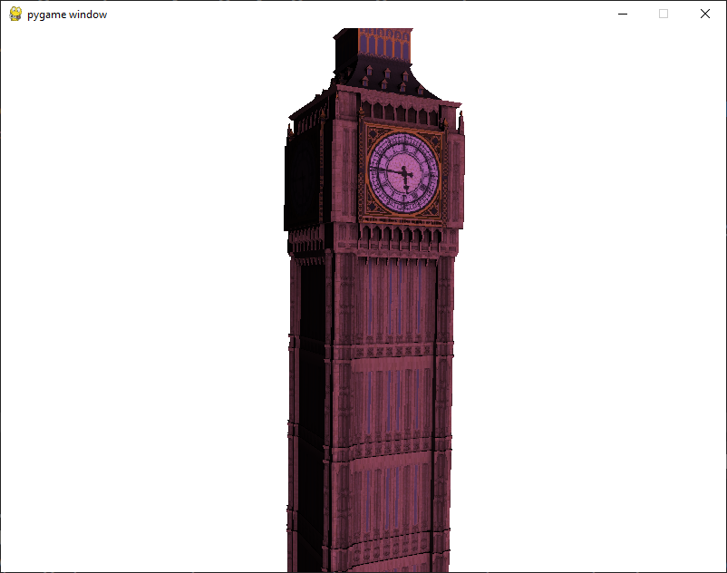

# Proyecto 4: OpenGL

## Resultado:

Se logró lo siguiente:

## Instrucciones
- {Z}:
Fill

- {X}:
Wireframe

- {C}:
luz en el eje X

- {V}:
luz en el eje Z

- {B}:
luz en el eje Y

- {P}:
Shader de RGB Gaming PC MASTER RACE 144FPS @ 144Hz res: 4k

- DERECHA:
Rotacion (Eje X)

- IZQUIERDA:
Rotacion (Eje X)

- ARRIBA:
Rotacion (Eje Y)

- ABAJO:
Rotacion (Eje Y)

- {M}:
Zoom in
- {N}:
Zoom out

## Objetivo
El objetivo de éste proyecto es demostrar los conocimientos adquiridos durante la segunda mitad del curso.

## Requerimientos
Deben entregar un programa que renderiza un modelo 3D. Deben utilizar OpenGL 3.30 o superior y renderizar utilizando el pipeline de shaders. Para cargar los modelos y para crear las matrices pueden utilizar librerías externas. 

## Puntos:
- 20 puntos por cada shader distinto que se implemente. Máximo de 3 shaders (pueden poner los shaders que quieran, pero solo los primeros 3 valen puntos, si el shader no hace nada más que pasar las variables al pipeline no cuenta).
- 10 puntos por utilizar texturas
- 10 puntos por utilizar normales
- 20 puntos por implementar una cámara (para que valga puntos, la cámara debe poder moverse o rotar, pero no debe atravesar modelos sólidos)
- 0 - 20 puntos según la estética del modelo

## Referencias

[Repositorio de Github de Dennis Aldana](https://github.com/denn1s/python-opengl-playground)
